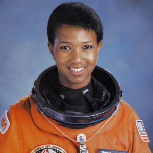

Мэй Джемисон родилась 17 октября 1956 года в городе Декейтер (штат Алабама). Её отец работал техническим инспектором в благотворительной организации, а мать большую часть своей карьеры была учителем английского языка и математики в начальной школе.

Её семья переехала в Чикаго, когда Джемисон было три года, так как там было больше возможностей дать ей хорошее образование. По словам Мэй, она с детства считала, что попадёт в космос, и мечтала, что это будет так же обычно, как ходить на работу. Тогда же началось её увлечение наукой и медициной.

Мэй окончила среднюю школу в 1973 году и поступила в Стэнфордский университет в возрасте 16 лет. По её воспоминаниям, там ей пришлось столкнуться с некоторой дискриминацией по цвету кожи и полу, но она успешно закончила университет в 1977 году, получив степень бакалавра наук по химическому машиностроению и бакалавра искусств в афроамериканских исследованиях.

Она продолжила своё образование и в 1981 году получила степень доктора медицины в Корнеллском медицинском колледже. Проработала год в интернатуре медицинского центра Университета Южной Калифорнии, а затем стала врачом общей практики. За время учёбы в колледже она совершила поездки в Кубу, Кению и Таиланд, оказывая медицинскую помощь людям, живущим там. После окончания медицинской практики, Джемисон вошла в состав корпуса мира и служила там врачом с 1983 по 1985 год, отвечая за охрану здоровья волонтёров корпуса, работающих в Либерии и Сьерра-Леоне.

Мэй Джемисон была зачислена в 12-й набор астронавтов, став первой афроамериканкой, отобранной НАСА. По окончании курса подготовки она получила в августе 1988 года квалификацию специалиста полёта. Ей было поручено тестирование программного обеспечения в лаборатории интеграции электронного оборудования шаттлов (SAIL). Её первый и единственный полёт на борту шаттла Индевор проходил с 12 по 20 сентября 1992 года. Его общая продолжительность составила 7 суток, 22 часа, 31 минуту и 11 секунд.

Мэй покинула отряд астронавтов и НАСА в марте 1993 года.

После ухода из НАСА в 1993 году она начала заниматься пропагандой медицинских знаний и охраной здоровья в Западной Африке. В этом же году она получила приглашение сняться в эпизодической роли в одной из серий «Звёздного пути». Тем самым Мэй стала первым настоящим астронавтом, снявшимся в этом фантастическом сериале.

В дальнейшем Мэй принимала деятельное участие во многих образовательных и просветительных проектах, таких, как «Международный научный лагерь» в Чикаго для привлечения молодёжи к научным исследованиям или проект телекоммуникационного спутника «Альфа», предназначенного для создания системы телемедицины в Африке. В 1999 году она основала корпорацию BioSentient, которая занималась разработкой портативного прибора, способного непрерывно наблюдать за состоянием вегетативной нервной системы. BioSentient в своей работе коммерциализировала некоторые патенты НАСА. В настоящее время Джемисон по-прежнему решительно выступает в поддержку науки и образования. Играла саму себя в документальном многосерийном фильме 2018 года «Неизвестная планета Земля» от National Geographic.