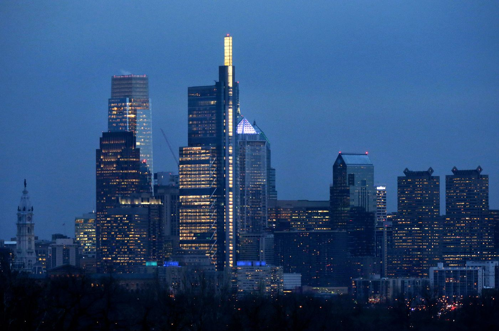

В большинстве городов США деловой центр называют даунтаун, но в Филадельфии это название не прижилось. Вместо этого филадельфийцы называют центр города Center City. Но как появилось такое название и как долго оно используется? Существует две версии.

### Сила рекламы

Записи архива филадельфийской газеты Inquirer показывают, что названия `“center of city”` и `“centre of city”` начинают появляться в рекламе в 1870-х годах.

В начале 20 века название `“Center of City”` также появляется в заголовках статей. “How Realty Rises in Center of City” говорит один заголовок в 1906 году. “1000 New Lamps Flood Center of City with Light” говорит другой заголовок в 1910.

В 1920 году название “Center City” появляется в объявлениях, включая объявления, рекламирующие удобство недвижимости в пригородах.

В течении 20х - 30х годов название “Center City” становится ходовым в рекламных объявлениях, в названиях зданий и используется городскими властями.

Таким образом, к 1947 году название “Center City” стало общепризнанным для центрального района города Филадельфия.

### Другая версия

Цитируя «Центр города: его взлет и падение», Роберта Фогельсона, Пол Леви, основатель и глава компании Center City District, говорит, что термин «центр города» вошел в употребление только после гражданской войны и вначале обозначал плотный коммерческий кластер в нижнем Манхэттене.

“До середины 19-го века и европейцы, и американцы использовали термины “City center” или “town center”  для описания коммерческого центра города, - сказал Леви в электронном письме. «City center - это термин, который до сих пор используется в Англии, ‘centre de ville’ во Франции и ‘centro’ во многих испаноговорящих странах.”

Леви также заметил, что люди, жившие в районе, который теперь известен как South Philadelphia, традиционно использовали слово “downtown” для обозначения своего района.

Леви полагает, что из-за того что название downtown было занято и учитывая наше английское и европейское происхождение, мы дали нашему центру города название “Center City”.

В то время в других городах используют слово downtown, по крайней мере в двух других, городах Цинциннати и Шарлотт, также используют Center City для обозначения своих деловых районов.